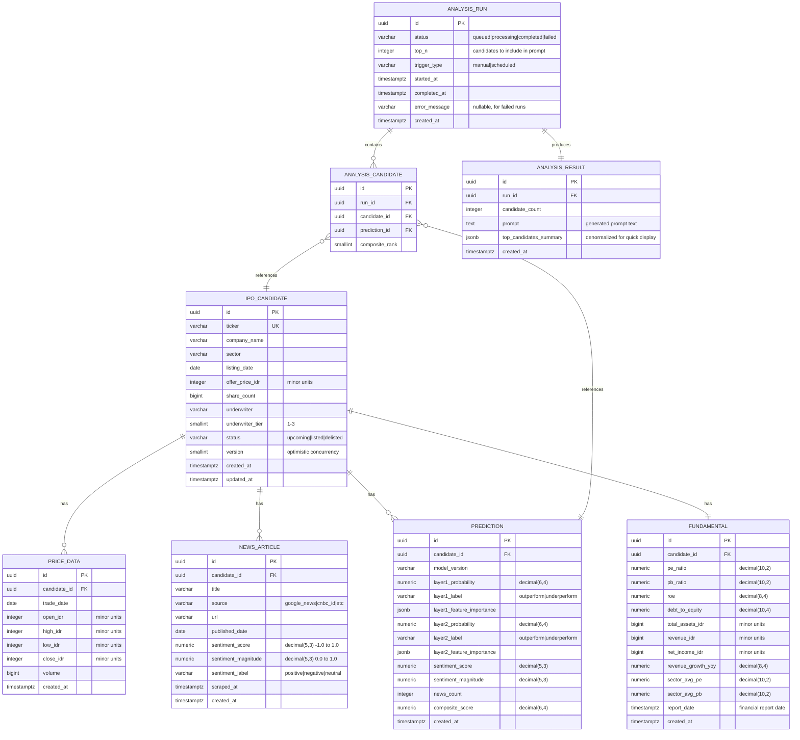

# Database Schema

## Overview

Single PostgreSQL 16 database owned by the NestJS API. The ML service has read-only access for bulk feature extraction. All migrations are managed by NestJS (TypeORM).

Constraints per DATA-001:
- All timestamps in UTC (timestamptz).
- Monetary amounts in integer minor units (IDR, no float).
- Multi-table mutations inside transactions.
- Paginate growable datasets.
- Optimistic concurrency via version column where needed.

## Entity Relationship Diagram

## Tables Detail

### ipo_candidate

Primary entity. One row per IPO. Ticker is unique. Status tracks lifecycle: `upcoming` (announced but not listed), `listed` (trading), `delisted` (removed).

**Indexes:**
- `idx_candidate_ticker` UNIQUE on `ticker`
- `idx_candidate_status` on `status`
- `idx_candidate_listing_date` on `listing_date`
- `idx_candidate_sector` on `sector`

### fundamental

One-to-one with ipo_candidate. Contains financial metrics from the prospectus. All monetary values in IDR minor units (no decimals needed since IDR has no subunits, but stored as bigint for consistency).

**Indexes:**
- `idx_fundamental_candidate` UNIQUE on `candidate_id`

### price_data

Daily OHLCV from yfinance. One row per candidate per trading day. Only populated after listing date.

**Indexes:**
- `idx_price_candidate_date` UNIQUE on `(candidate_id, trade_date)`
- `idx_price_trade_date` on `trade_date`

### news_article

Headlines scraped from Google News and financial sites. Sentiment scores are populated by the ML service after XLM-RoBERTa processing. Each article is processed once; re-scraping the same URL is idempotent.

**Indexes:**
- `idx_news_candidate` on `candidate_id`
- `idx_news_url` UNIQUE on `url`
- `idx_news_published` on `published_date`

### prediction

ML model outputs. One prediction per candidate per model version. Contains both layer scores, feature importance (JSONB for flexibility), and the aggregated sentiment.

**Indexes:**
- `idx_prediction_candidate` on `candidate_id`
- `idx_prediction_candidate_version` UNIQUE on `(candidate_id, model_version)`

### analysis_run

Tracks each analysis cycle (manual or scheduled). Status progresses through `queued` -> `processing` -> `completed` (or `failed`).

**Indexes:**
- `idx_run_status` on `status`
- `idx_run_created` on `created_at`

### analysis_candidate

Join table linking an analysis run to the candidates it evaluated. Stores the composite rank for that run.

**Indexes:**
- `idx_ac_run` on `run_id`
- `idx_ac_candidate` on `candidate_id`

### analysis_result

Stores the generated prompt and a denormalized summary of top candidates for quick dashboard display without joining.

**Indexes:**
- `idx_result_run` UNIQUE on `run_id`

## Migration Strategy

Migrations are TypeORM migration files in `apps/api/src/migrations/`. Each migration is:
- Timestamped (auto-generated by TypeORM CLI)
- Idempotent where possible (use `IF NOT EXISTS`)
- Run via `npm run migration:run` in the API container
- Rollback via `npm run migration:revert`

The initial migration creates all tables. Subsequent migrations add columns, indexes, or new tables as the schema evolves.
