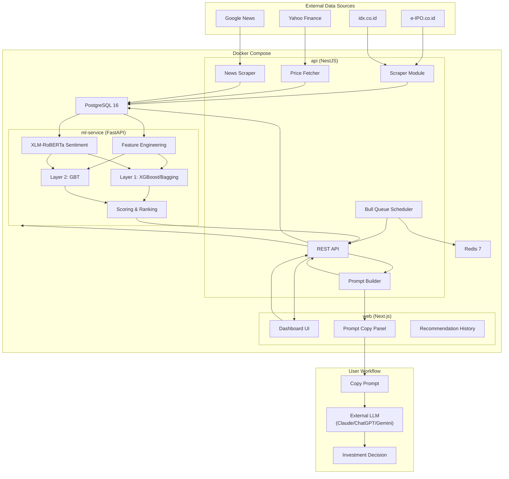
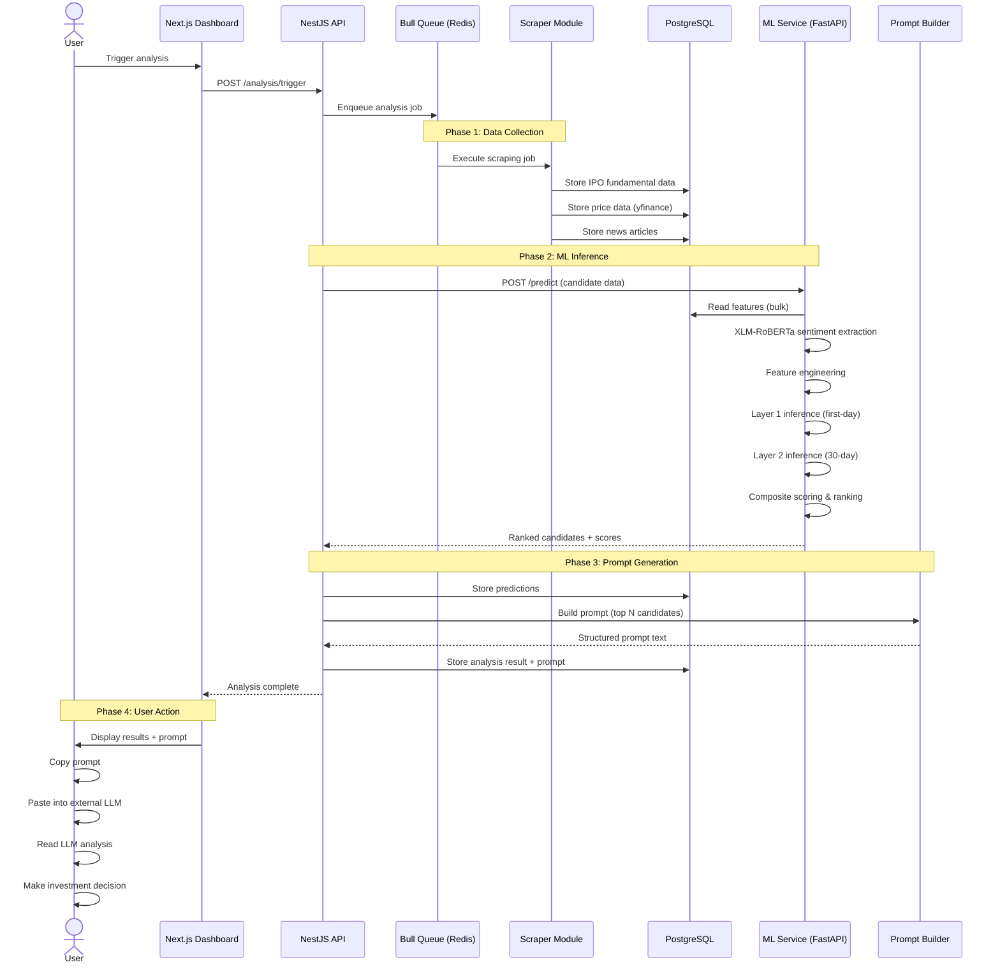
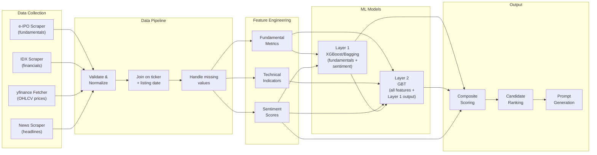

# Flow Overview

## System Architecture

## Analysis Cycle (Happy Path)

## Data Pipeline Flow

## Scoring Logic

The composite score for each IPO candidate uses a weighted average:

| Component | Weight | Source |
|-----------|--------|--------|
| Layer 1 score (first-day probability) | 50% | XGBoost/Bagging output |
| Layer 2 score (30-day probability) | 30% | GBT output |
| Sentiment score (normalized 0-1) | 20% | XLM-RoBERTa |

Candidates are ranked by composite score descending. Top N (default: 3-5) are included in the generated prompt. Candidates with Layer 1 score below 50% are excluded regardless of other scores.

## Scheduled vs Manual Triggers

| Trigger | Mechanism | When |
|---------|-----------|------|
| Manual | User clicks "Run Analysis" in dashboard | On demand |
| Scheduled | Bull Queue cron job | Configurable (default: daily at market open, 09:00 WIB) |

Both triggers execute the same analysis cycle sequence. Scheduled runs store results and the user reviews them later.
